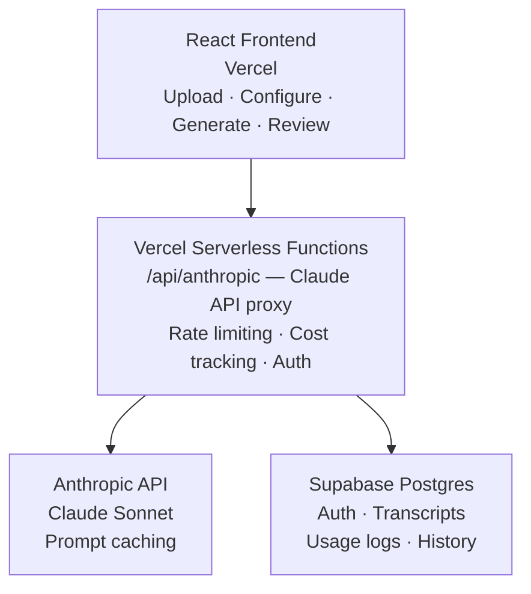

# Case Study: AI Content Repurposing Engine

**Role:** Product Manager (spec + build)
**Stack:** React, Vite, Tailwind CSS, Claude API (Anthropic), Supabase, Vercel
**Status:** Live — internal adoption in progress

> This is a case study. No proprietary code or internal data is included. See `NOTICE.md`.

---

## The Problem

B2B marketing teams — especially lean ones — have an asymmetric content problem. They invest heavily in producing long-form content: webinars, customer interviews, product demos, thought leadership podcasts. Then that content sits. Repurposing it into LinkedIn posts, email sequences, blog summaries, and executive briefs requires 3-4 hours of manual work per piece — work that is repetitive, skilled enough to require a real person, but not skilled enough to be anyone's highest-value use of time.

For a solo marketer managing a full content calendar, this bottleneck means most long-form content gets one distribution push and then goes dark. The ROI on content production collapses.

---

## My Role

I identified the problem, defined the product, and built the full application using AI-assisted development. No engineering team — I shipped it myself.

The tool was built specifically to serve our internal marketing team first, with the architecture deliberately designed to support broader B2B use cases as adoption grows.

---

## What I Built

### Core Workflow
1. Upload a transcript (`.txt`, `.docx`, `.vtt`, `.srt`, `.pdf`)
2. Configure or upload your brand voice (guide or examples)
3. Select which content types to generate
4. Adjust tone per output (formal, casual, technical)
5. Receive 10+ content pieces ready to copy, edit, or download

**Content types generated:**
- LinkedIn posts (5 variations)
- Long-form blog post
- Email nurture sequence (5 emails)
- Twitter/X thread
- Executive summary

### Brand Voice System
The most important design decision: outputs are calibrated to the customer's actual voice, not generic AI prose. Users provide a brand guide or paste examples of content they already like, and the system uses that context on every generation via prompt caching — keeping costs low while maintaining consistency across the session.

### Infrastructure
- **Frontend**: React + Vite + Tailwind — fast, stateless UI
- **AI**: Claude Sonnet via Vercel serverless functions — keeps API keys server-side, enables per-request usage tracking
- **Auth + Storage**: Supabase — user accounts, transcript storage, generation history
- **Rate limiting**: Tiered by account level (free → starter → pro → enterprise) — built for productization from day one, not bolted on later

---

## Architecture

---

## Key Design Decisions

**1. Transcript-in, content-out — no transcription**
Transcription is a solved problem (Otter.ai, Descript, platform-native tools). Adding it to the scope would double the complexity for zero differentiation. The tool does one thing: turn existing transcripts into usable content.

**2. Brand voice as a first-class input**
Generic AI content is the enemy of adoption. If the first outputs sound like a press release, the marketer won't come back. Requiring a brand voice input up front — and using it on every generation — makes the outputs feel owned, not assembled.

**3. Multiple variations, not one answer**
For LinkedIn posts, the tool generates five variations. This isn't padding — it's how creative review actually works. Having options to react to ("I like the hook on #3, the angle on #2") is faster than editing a single output from scratch.

**4. Tiered rate limits built in from day one**
The infrastructure is architected for a commercial product, not just an internal tool. Tiered rate limiting (free/starter/pro/enterprise), cost tracking per request, and usage logging were built before we had paying users — because retrofitting these is painful and signals to the team that we're building something real.

**5. Serverless functions as the API layer**
Keeping Claude API calls server-side (via Vercel functions) rather than calling the API directly from the browser means API keys never touch the client, rate limiting logic lives in one place, and adding auth checks or logging is trivial.

---

## The Adoption Story

The tool is live. The honest current state: our internal marketing team is in early stages of AI adoption, and the workflow change required to use a new tool — even one that saves hours — requires more than just shipping the product.

This is a change management problem, not a capability problem. The tool works. The next phase is:
1. Running a structured pilot with defined inputs and success criteria
2. Showing before/after time comparisons on real content
3. Getting one "this is 90% of the way there" moment that converts a skeptic

Building ahead of team readiness is a calculated bet. A PM who waits for consensus before building rarely ships anything worth showing.

---

## Outcomes

- Full application built and deployed in production
- Brand voice system generates consistent, on-brand outputs across content types
- Tiered infrastructure ready to support external users without rearchitecting
- Internal adoption in progress — structured pilot planned

---

## Lessons Learned

- **Adoption is a product problem.** Shipping the tool was phase one. The real product work is reducing the activation energy to try it — better defaults, a faster first win, a demo mode that doesn't require setup.
- **Rate limiting is unglamorous and essential.** Building it after launch would have been painful. It took half a day to do it right up front.
- **Prompt caching changes the economics.** Long brand voice contexts are expensive to resend on every call. Caching them drops per-generation cost significantly and makes the product viable at scale.
